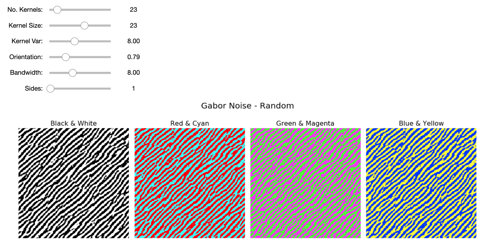

# Procedural Adversarial Perturbations

This repository contains sample code and an interactive Jupyter notebook for the paper ["Procedural Noise Adversarial Examples for Black-Box Attacks on Deep Convolutional Networks"](https://arxiv.org/abs/1810.00470).

Procedural noise functions are used to generate textures in computer graphics. In this work we present various types of procedural noise to generate adversarial perturbations against popular deep neural network architectures trained on the ImageNet image classification task.

The results show that adversarial examples can be generated using procedural noise **without any knowledge of the target classifier.** This demonstrates the instability of current neural networks to procedural noise patterns.

We encourage you to explore our Python notebooks and make your own adversarial examples! For the best experience, we recommend using a GPU:

1. **intro\_gabor:** A brief introduction to Gabor noise. 


2. **slider\_gabor, slider\_perlin:** Visualize and interactively play with the parameters. See the other slider notebooks for different procedural noise functions.


3. **intro_bopt:** See how Bayesian optimization can automatically find parameters to fool a classifier on an image.

See our [paper](https://arxiv.org/abs/1810.00470) for more details: "Procedural Noise Adversarial Examples for Black-Box Attacks on Deep Neural Networks." Kenneth T. Co, Luis Muñoz-González, Emil C. Lupu. arXiv 2019.

## Python Dependencies

* [GPy](https://pypi.org/project/GPyOpt/)
* [GPyOpt](https://pypi.org/project/GPy/)
* ipywidgets
* Keras
* matplotlib >= 2.0.2
* [noise](https://pypi.org/project/noise/)
* numpy
* [OpenCV](https://pypi.org/project/opencv-python/)
* tensorflow

## Acknowledgments

Learn more about the [Resilient Information Systems Security (RISS)](http://rissgroup.org/) group at Imperial College London. The main author is partially supported by [Data Spartan](http://dataspartan.co.uk/). Data Spartan is not affiliated with the university.

Please cite this paper if you use the code in this repository as part of a published research project.

```
@article{co2019procedural,
  title={Procedural Noise Adversarial Examples for Black-Box Attacks on Deep Neural Networks},
  author={Co, Kenneth T and Mu{\~n}oz-Gonz{\'a}lez, Luis and Lupu, Emil C},
  journal={arXiv preprint arXiv:1810.00470},
  year={2019}
}
```
This project is licensed under the MIT License, see the [LICENSE.md](LICENSE.md) file for details.
