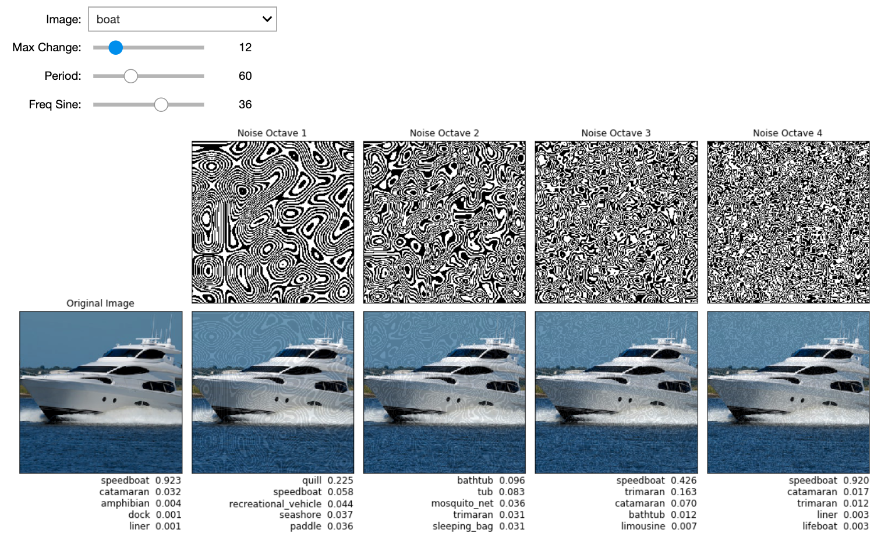

# Procedural Adversarial Perturbations

This repository contains sample code and an interactive Jupyter notebook for the papers ["Procedural Noise Adversarial Examples for Black-Box Attacks on Deep Convolutional Networks"](https://arxiv.org/abs/1810.00470) and ["Sensitivity of Deep Convolutional Networks to Gabor Noise"](https://openreview.net/forum?id=HJx08NSnnE).

In this work, we show that _universal adversarial perturbations_ can be generated with **procedural noise** functions without any knowledge of the target model. Procedural noise functions are a lightweight and low-cost way for generating textures in computer graphics. Our results demonstrate the instability of existing deep convolutional networks on computer vision tasks to these inexpensive patterns.

We encourage you to explore our Python notebooks and make your own adversarial examples:

1. **intro\_gabor:** A brief introduction to Gabor noise. 


2. **slider\_gabor, slider\_perlin:** Visualize and interactively play with the parameters to see how it affects model predictions.


3. **intro_bopt:** See how Bayesian optimization can automatically find parameters to fool a classifier on an image.

See our [paper](https://arxiv.org/abs/1810.00470) for more details: "Procedural Noise Adversarial Examples for Black-Box Attacks on Deep Convolutional Networks." Kenneth T. Co, Luis Muñoz-González, Emil C. Lupu. arXiv 2019.

## Python Dependencies

* [GPy](https://pypi.org/project/GPyOpt/)
* [GPyOpt](https://pypi.org/project/GPy/)
* ipywidgets
* Keras
* matplotlib >= 2.0.2
* [noise](https://pypi.org/project/noise/)
* numpy
* [OpenCV](https://pypi.org/project/opencv-python/)
* tensorflow

## Acknowledgments

Learn more about the [Resilient Information Systems Security (RISS)](http://rissgroup.org/) group at Imperial College London. The main author is partially supported by [Data Spartan](http://dataspartan.co.uk/). Data Spartan is not affiliated with the university.

Please cite these papers, where appropriate, if you use code in this repository as part of a published research project.

```
@article{co2019procedural,
  title={Procedural Noise Adversarial Examples for Black-Box Attacks on Deep Convolutional Networks},
  author={Co, Kenneth T and Mu{\~n}oz-Gonz{\'a}lez, Luis and Lupu, Emil C},
  journal={arXiv preprint arXiv:1810.00470},
  year={2019}
}

@inproceedings{co2019sensitivity,
  title={Sensitivity of Deep Convolutional Networks to Gabor Noise},
  author={Co, Kenneth T and Mu{\~n}oz-Gonz{\'a}lez, Luis and Lupu, Emil C},
  booktitle={ICML 2019 Workshop on Identifying and Understanding Deep Learning Phenomena},
  year={2019}
}
```
This project is licensed under the MIT License, see the [LICENSE.md](LICENSE.md) file for details.
